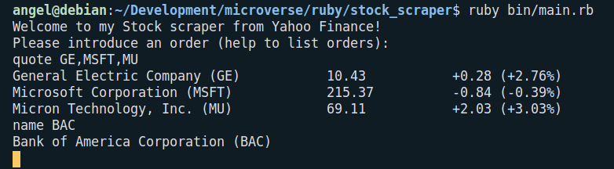

# Ruby Programming

## STOCK SCRAPER FROM YAHOO FINANCE!

This a stock scraper. You can get financial information about your favorite stocks from the command line.

## To install and run

- Clone the project repo
- Make sure [Ruby-lang](https://www.ruby-lang.org/en/) is installed
- Run `ruby bin/main.rb`

## Instructions

The application will ask for instructions to proceed. You should introduce an order followed by one or multiple stock tickers separated by commas.
The available orders are:
- name: Returns the name of the stock, ex: `name MSFT`
- price: Returns the price of the stock, ex: `price GE`
- diff: Returns the difference in price from the previous day, ex: `diff AAPL`
- quote: Returns the name, price, and difference from yesterday of a given stock, ex: `quote GOOG`
- help: Lists the available orders
- finish: Ends the application

If you want to request multiple stocks you can type: `quote NVDA, MU, BAC`

## Designed With
- Ruby
- Git
- Gitflows
- Rubocop
- VS Code
- [Repl.it](https://repl.it/@AngelLuisLuis1/stockscraper)

## Contribute to this Project

Contributions, issues, and feature requests are welcome! Start by:

  - Forking the project
  - Cloning the project to your local machine
  - cd into the project directory
  - Run git checkout -b your-branch-name
  - Make your contributions
  - Push your branch up to your forked repository
  - Open a Pull Request with a detailed description of the development branch of the original project for a review

## Authors

👤 **Angel Barros**

- GitHub: [@Zappat0n](https://github.com/Zappat0n)
- LinkedIn: [LinkedIn](https://www.linkedin.com/in/angel-luis-barros-pazos-8889011b5/)

## Show your support

Give a ⭐️ if you like this project!
